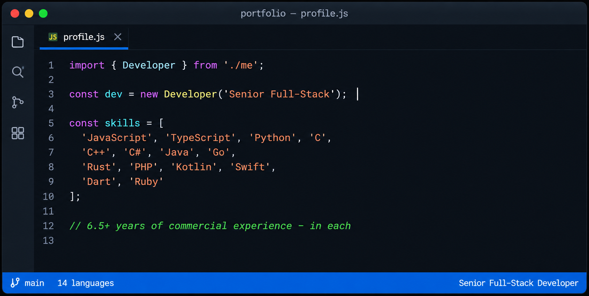
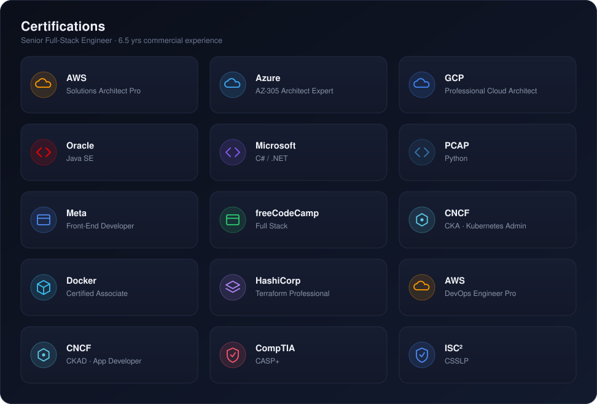

### Hi, I'm alukard-001 👋

Senior Full-Stack Engineer. I design and ship production-grade systems —
not tutorials, not CRUD demos. Multi-tenant architectures, real-time
infrastructure, distributed backends that hold up under real load.

14 languages isn't a party trick — it's the toolbox of someone who picks
the right technology for the problem instead of forcing every project
into the same stack. Django or Go for the backend, Rust when performance
actually matters, Next.js/React on the frontend, Kotlin/Swift for native
mobile — whatever the system needs.

6.5+ years building things that outlive the sprint they were written in:
clean architecture, systems that scale past the demo, code that survives
contact with real users and real traffic.

📫 **Reach me:** alukardttn@icloud.com

### 🏅 Certifications

